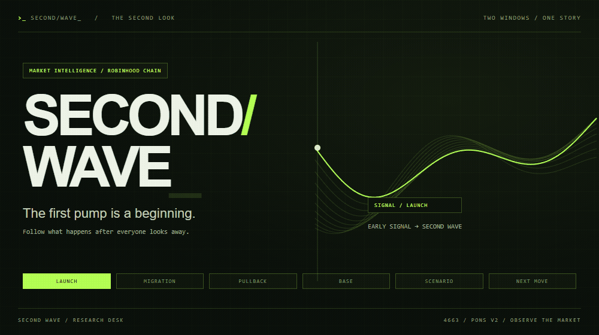

<p align="center"><sub>by <a href="https://x.com/0xchewa">0xchewa</a></sub></p>

<p align="center"><a href="https://github.com/0xchewa/secondwave/actions/workflows/ci.yml">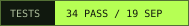</a> 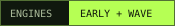 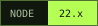  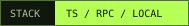</p>

<p align="center"><a href="#run-it-locally"><b>RUN THE DESK ?</b></a> &nbsp; / &nbsp; <a href="#second-wave--read-the-structure">THE METHOD</a> &nbsp; / &nbsp; <a href="#open-the-model-desk">MODEL RECORD</a> &nbsp; / &nbsp; <a href="docs/README.md">FIELD MANUAL</a></p>

## You still have the chart open

You caught the launch. Watched the first candle go vertical. Sold into the pullback. A few hours later, the same ticker is back in your group chat.

**The position ended. The story kept going.**

Second Wave follows that story on **Pons v2, Robinhood Chain**. Early Signal studies a launch at the point where its first information becomes available. Second Wave follows the structure after migration: the first move, the retracement, the base and the life of a scenario.

This edition is a **read-only, local research console**. Launch-time ranking, scenario detection, model explanations and frozen artifacts run on your machine. Start with **196 recorded on-chain markets**, then continue collection directly through your Robinhood Chain RPC. No account, wallet, database or hosted API is needed.

```sh
git clone https://github.com/0xchewa/secondwave.git
cd secondwave
npm ci
npm start
```

Windows Terminal, macOS and Linux ? Node 22.x ? Press **?** for controls

### Pick a rabbit hole

| The product | The research | The machine room |
|:---|:---|:---|
| [Second Wave life cycle](#second-wave--read-the-structure) | [The Wave research ledger](#the-wave-research-ledger) | [From block to screen](#from-block-to-screen) |
| [Early Signal](#early-signal--read-the-launch) | [Ranking, with denominators](#ranking-with-denominators) | [Reproducible records](#open-the-model-desk) |
| [Inside a token](#one-contract-a-continuous-record) | [Causal features and release gates](#the-research-loop) | [Run it locally](#run-it-locally) |

## Second Wave / read the structure

A migrated token has already passed one threshold. What happens afterwards is a different problem. A chart can retrace, trade sideways, form a base and still fail. Second Wave turns those observations into a scenario with explicit boundaries and a clock.

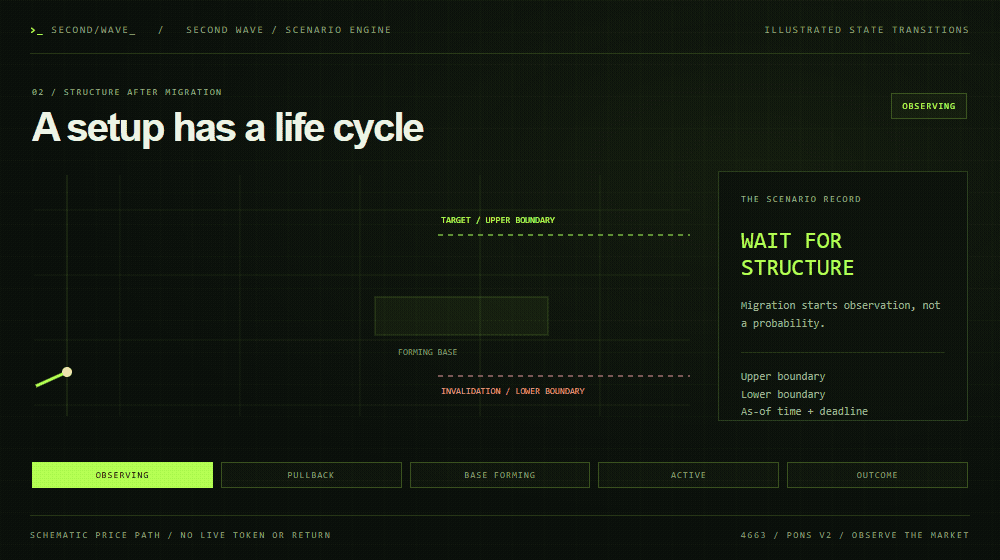

### The setup has a life cycle

| Stage | What the Terminal is telling you |
|:---|:---|
| **OBSERVING** | The migrated market is being watched for a qualifying first move and subsequent structure. |
| **PULLBACK** | A retracement is developing after the first move. Its depth, duration and activity become context. |
| **BASE FORMING** | The engine is checking whether the observed range is stable enough to form a scenario. |
| **ACTIVE** | A scenario has an upper boundary, a lower boundary, an observation time and a deadline. |
| **IMPULSE** | The upper move was confirmed before a lower-boundary failure. |
| **INVALIDATED** | The lower boundary was breached before a confirmed impulse. |
| **EXPIRED / UNRESOLVED** | The setup or its observation window ended; the recorded state explains which condition applied. |

These are states of an observed setup. They have their own meaning even while the probability model remains behind its release gate.

### What goes into a scenario

**The move before the base.** The engine keeps the earlier peak, the size of the rise, retracement and time since migration. That gives the base a history instead of treating every flat patch of chart as the same pattern.

**The quality of the base.** The research engine uses an observation window, distinct transactions and time bins. Its robust base estimator uses price quantiles and median absolute deviation. Width, stability, elapsed time and the price at the assessment all matter. The formulas are inspectable in [the scenario engine](src/engines/wave24/engine.ts).

**The pressure around it.** The Terminal exposes observed flow with its time window. The 60-second sell-pressure share is:

```text
sell pressure = observed sell quote volume
                ─────────────────────────────────────────
                observed buy + sell quote volume
```

Quote units stay attached. A zero denominator has no defined percentage. A partial interval carries a coverage state. The number describes the observed flow; it is not a forecast of the next red candle.

**The boundaries after it.** An assessment records its upper and lower levels, base, prior peak and deadline. Outcomes are evaluated in chain order against the scenario that existed at that moment. The Wave24 research task uses a 24-hour horizon and records supporting block, log, hash and transaction evidence for resolved outcomes.

<details>
<summary><b>Open the scenario notebook / feature families</b></summary>

| Family | Examples in the research code |
|:---|:---|
| Path | First rise, retracement, age, time since peak, price relative to peak |
| Base | Duration, width, volatility, compression, rebound from local low |
| Flow | Buy/sell counts, quote-volume imbalance, activity acceleration, largest sell share |
| Geometry | Distance to upper/lower boundaries, volatility-normalized distances |
| Provenance | Feature version, assessment time, block/log order, coverage |

The original Wave24 feature set and scenario-aware candidate are separate versions. The same causal feature implementation is used in replay and live evaluation; later observations cannot enter an earlier assessment.

[Feature code](src/engines/wave24/scenario-features.ts) · [Fixed comparison plan](docs/MODELS.md) · [Evaluation engine](src/engines/wave24/engine.ts)

</details>

### Inside the local Wave desk

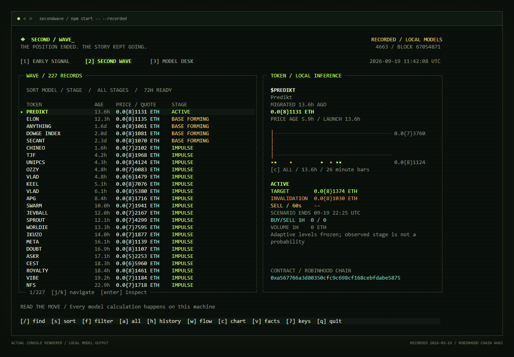

<sub>Recorded inputs from 19 September 2026, calculated locally. [Wave](docs/github/console-wave.png) ? [Early](docs/github/console-early.png) ? [Models](docs/github/console-models.png) ? [Capture record](docs/github/console-capture.json)</sub>

A compact feed and an inspection pane keep the market and its context together. Read stage, age, quote price, target, invalidation and observed **60-second sell pressure**. The inspector connects those values to the retained trade path and the model's explanations. Small terminal? Press Enter to open the inspector across the screen.

| Key | Action | Key | Action |
|:---|:---|:---|:---|
| `1` / `2` / `3` | Early / Wave / models | `/` | Search symbol or contract |
| `?` / `?` or `j` / `k` | Select a token | `s` / `f` | Sort / filter |
| `Enter` | Open the inspector | `e` | Export the selected calculation |
| `l` | Start RPC collection | `?` / `q` | Controls / quit |

Search covers **every record in the local session**, including rows outside the visible screen. This small standalone collector watches a bounded set of recent markets; arbitrary historical contracts need an imported session containing their observations. It does not claim a complete market census.

## The Wave research ledger

Hundreds of assessments from one token still describe one token. The dataset uses the earliest mature assessment per independent token so a long, busy chart cannot manufacture a large sample by itself.

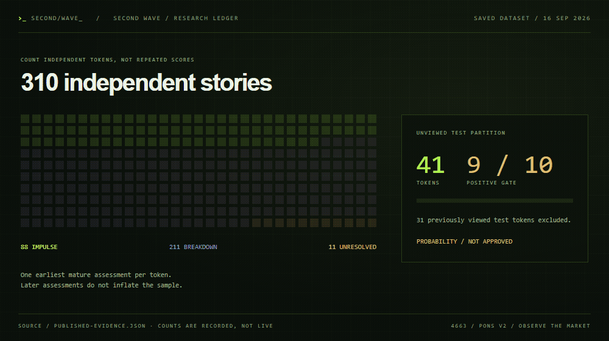

| Saved research checkpoint | Count |
|:---|---:|
| Independent tokens in the expanded dataset | **310** |
| Impulse / breakdown / unresolved outcomes | **88 / 211 / 11** |
| Previously viewed test tokens excluded from the new test partition | **31** |
| New unviewed test partition | **41 tokens · 9 positives** |
| Required positive count for the next fit gate | **10** |

This is the dated [published research record](data/evidence.json), not a live production census. The expanded probability candidate was not activated: the frozen quality gates failed, and the subsequent unviewed partition still had 9 positives against a minimum of 10. The public Wave experience therefore centers on observed structure and scenario evidence. The release gate is part of the research record too.

## Early Signal / read the launch

Early Signal starts upstream: what can be known about a launch before its later outcome exists? Launch-time features describe the transaction, caller context, prior launch history and the model's eligible comparison universe. The console pairs relative rank with three feature contributions and the available launch facts. The primary display is TOP %, measured against the frozen eligible reference population.

The useful interaction is fast: scan, compare, open the contract, inspect why it ranked there. Eligibility and missing-data states stay separate from the model's explanations. Unsupported quote units cannot quietly turn into a convincing-looking USD price.

### Ranking, with denominators

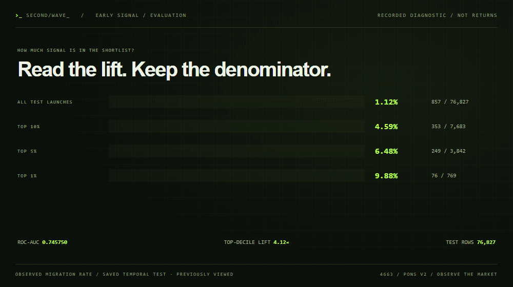

| Saved test group | Migrated / launches | Observed migration rate |
|:---|---:|---:|
| All test launches | 857 / 76,827 | **1.12%** |
| Top 10% of the ranking | 353 / 7,683 | **4.59%** |
| Top 5% | 249 / 3,842 | **6.48%** |
| Top 1% | 76 / 769 | **9.88%** |

The top-decile group had **4.12×** the observed migration rate of the full diagnostic set. That measures concentration in a ranking. It does not establish a trading return, execution price or calibrated probability for a new token.

| Evaluation and integrity | Saved result |
|:---|---:|
| Training / calibration / test rows | **89,671 / 71,486 / 76,827** |
| Causal event audit | **488,268 events · 0 missing** |
| Restart feature parity | **490 / 490** |
| ROC-AUC | **0.745750** |
| Average precision | **0.062661** |
| Brier score | **0.010961** |

All values come from the 16 September 2026 [published evaluation](data/evidence.json). This test set was previously viewed and remains diagnostic. Approved migration probabilities are gated. The console exposes the active rank-only behavior and does not label that rank as a chance of migration.

## Open the model desk

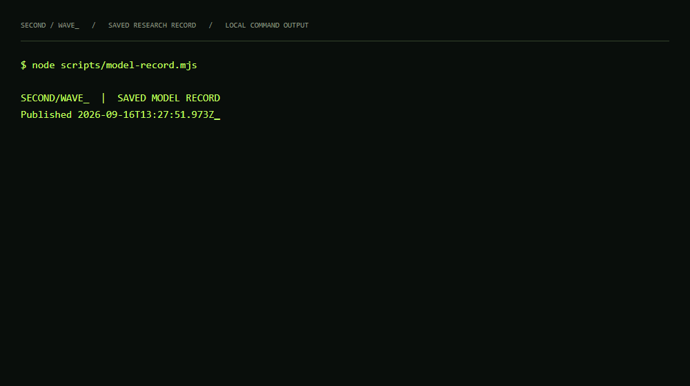

```sh
node scripts/model-record.mjs
npm run models
npm run bench
```

The first command prints the checked-in evaluation. The next two verify the shipped artifacts and numerical reference cases. They work without a database, credentials or a training run. **882 numerical assertions match the frozen reference values with zero absolute error.** That verifies implementation parity; prediction quality is reported separately above.

The Early, Wave and experimental peak-range artifacts were checked against the running model files on **19 September 2026**. Their SHA-256 digests and exact engine source hashes are in [models/manifest.json](models/manifest.json). Frozen weights and inference code are included; private raw archives, the full training dataset and the deployment pipeline are not part of this edition.

The console playback prints saved evidence. Animated research charts use the same dated record. The [media manifest](docs/github/research-media.json) distinguishes explanatory diagrams from recorded model output.

### The research loop

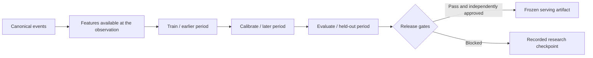

1. **Recover the record.** Verify event provenance, canonical ordering and quote decimals.
2. **Freeze the observation.** Compute features from information available at its as-of time.
3. **Respect time.** Train, calibrate and evaluate on separate temporal partitions.
4. **Keep the denominator.** Report independent tokens, positives, unresolved outcomes and excluded samples.
5. **Inspect the failure.** Record quality gates and versions even when a candidate stays out of production.
6. **Publish a frozen artifact.** The local desk reads the selected artifact; opening it does not train a model.

[Early research](docs/MODELS.md) · [Wave comparison plan](docs/MODELS.md) · [Data provenance](docs/DATA_SOURCES.md) · [Third-party notices](THIRD_PARTY_NOTICES.md)

## One contract, a continuous record

| Question at the desk | What to inspect |
|:---|:---|
| “Did I miss the launch?” | Local contract search, launch time, retained event path and migration time |
| “What made this one stand out?” | Early rank, available launch facts and model contributions |
| “Is the pullback becoming a base?” | Wave stage, base interval, width, target and invalidation |
| “Who is pressing the sell side?” | Observed sell share, activity interval and largest-sell context where available |
| “Is that number actually in dollars?” | The price's explicit quote unit; native quote prices remain in ETH |
| “Why does the chart stop there?” | Recorded coverage, retained sample and the local collector checkpoint |
| “Did the scenario work?” | Its recorded outcome, deadline and supporting chain evidence |

The boring distinctions are useful when the chart gets loud: absent data versus zero, FDV versus circulating capitalization, a curve's progress versus a model estimate, a short retained sample versus a lifetime history.

## From block to screen

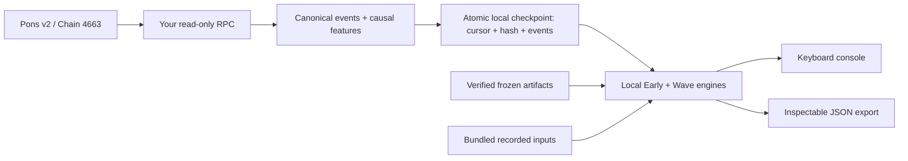

**The model lives here.** The RPC supplies chain observations. Ranking and scenario evaluation execute locally; there is no remote inference endpoint hidden behind the console.

**The cursor has a memory.** The included seed carries historical caller counts and exemption overlaps. New factory events advance those counters in chain order. A bounded visible feed does not reset the historical features to zero. The seed records **313,051 launch callers**, **44,348 migration callers** and **276,028 observed exemption addresses** at its checkpoint.

**A page either commits or stays put.** Block hashes are checked before and after collection. Cursor, model inputs and events are written together through an atomic file replacement. Failed RPC reads preserve the last committed page. A changed anchor stops collection so data from different forks cannot be silently mixed.

**The scope stays visible.** The local edition keeps up to 1,000 recent markets, watches up to 128 native-quote migrated pools and reads the 64 newest native-quote curves. Reserve progress is sampled for the newest eight curves per page. It retains a short recent trade tape plus model state, not a lifetime trading archive. See [data provenance and limits](docs/DATA_SOURCES.md).

## Run it locally

Use **Node 22.x** (22.12 or later), Git and a terminal with a monospace font. No PostgreSQL, Docker or wallet is required.

```sh
git clone https://github.com/0xchewa/secondwave.git
cd secondwave
npm ci
npm start
```

The first screen is explicitly marked **RECORDED**. It evaluates the included real inputs locally and makes no network requests. The recorded timestamp stays attached to the session.

### Switch on your own RPC

Copy `.env.example` to `.env` and set your provider URL:

```dotenv
SWAVE_RPC_URL=https://rpc.mainnet.chain.robinhood.com
```

```sh
npm start -- --live
```

The official public endpoint is the default. A provider supporting historical logs and state reads is useful for catching up from the seed. The desk labels **CATCHING UP** until the saved cursor reaches the confirmed head; first sync can take time as the seed gets older. It resumes from `.local/checkpoint.json.gz` after restart. RPC credentials stay in your ignored `.env`.

Prefer a finite collection job?

```sh
npm start -- sync --pages 2 --blocks 1000
npm start -- snapshot --state .local/checkpoint.json.gz --mode wave
npm start -- inspect 0xYOUR_CONTRACT --state .local/checkpoint.json.gz
```

The last command requires a contract already present in that local session. To export or import a portable record:

```sh
npm start -- export --state .local/checkpoint.json.gz --output .local/session.json.gz
npm start -- --input .local/session.json.gz
npm start -- snapshot --mode early --json
```

[Controls, RPC troubleshooting and recovery](docs/RUN_IT.md) ? [Official Robinhood Chain connection details](https://docs.robinhood.com/chain/connecting/)

### The verification bench

```sh
npm run check
npm run build
npm test
npm run bench
```

The dated badge records **34 public-console tests** passed on 19 September 2026. Checks cover frozen numerical outputs, resumed Wave scenarios, missing history, quote decimals, canonical ordering, reorg rejection, interrupted RPC reads, atomic state, terminal dimensions and unsafe terminal text. Synthetic cases are explicitly named. CI runs on Windows and Linux.

<details>
<summary><b>Rebuild the visual research desk</b></summary>

```sh
node scripts/render-research-media.mjs
npx tsx scripts/render-console.ts
```

Media tooling uses Chrome and ffmpeg. It renders local research evidence and the actual console cells; it does not need a public website or hosted API. Images and GIFs live in `docs/github`; intermediate frames stay in ignored `.local`.

</details>

### Project map

```text
src/cli.ts          entry point, commands and machine-readable output
src/tui/            keyboard desk, responsive panels and trade path
src/chain/          read-only RPC, Pons decoding and atomic collection
src/engines/        Early features, frozen inference and Wave scenarios
models/             current weights and source-integrity manifest
data/               recorded inputs, causal seed and research evidence
test/               model, replay, collector and console checks
scripts/            evidence playback and original research animations
docs/               field manual, methodology and data provenance
```

[Documentation index](docs/README.md) ? [Current status](docs/STATUS.md) ? [Publication scope](NOTICE.md) ? [Third-party notices](THIRD_PARTY_NOTICES.md)

---

<p align="center"><b>THE FIRST MOVE GETS ATTENTION<br>THE NEXT ONE NEEDS CONTEXT</b></p>
